### PROJECT 6: Web Solution With WordPress
## LAUNCH AN EC2 INSTANCE THAT WILL SERVE AS “WEB SERVER”.
Step 1 — Prepare a Web Server
Launch an EC2 instance that will serve as "Web Server". Create 3 volumes in the same AZ as your Web Server EC2, each of 10 GiB.

## Attach all three volumes one by one to your Web Server EC2 instance
## Open up the Linux terminal to begin configuration

`lsblk`.

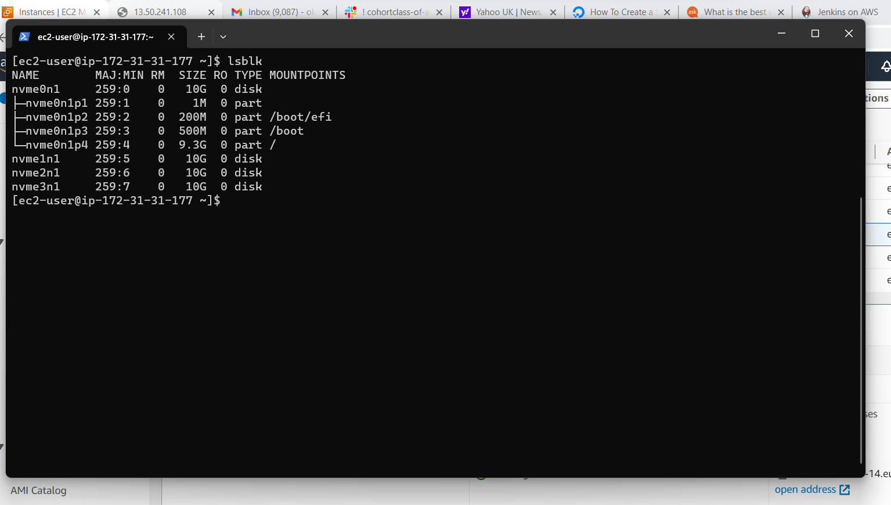

Check all mounts and free space on your server

`df -h`

 ### Use gdisk utility to create a single partition on each of the 3 disks

 `sudo gdisk /dev/nvme1n1`

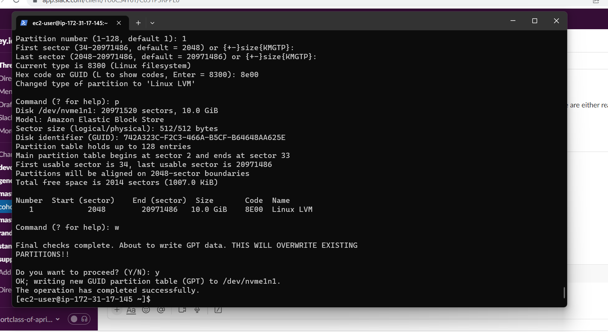

 `sudo gdisk /dev/nvme2n1`

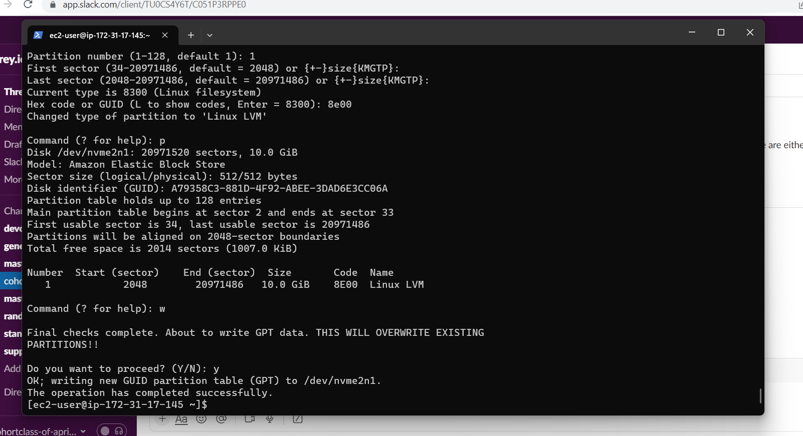

 `sudo gdisk /dev/nvme3n1`

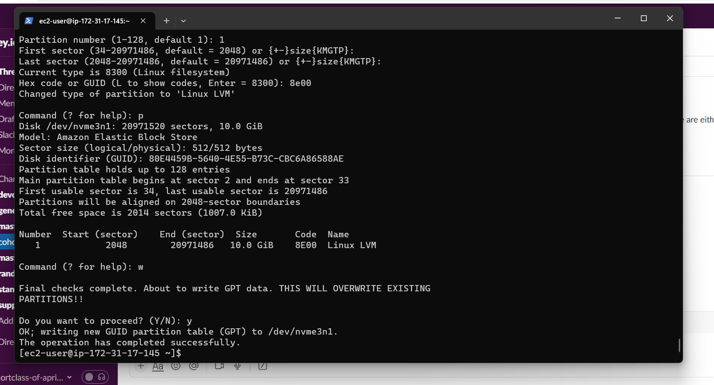

### Install lvm2 package

`sudo yum install lvm2`

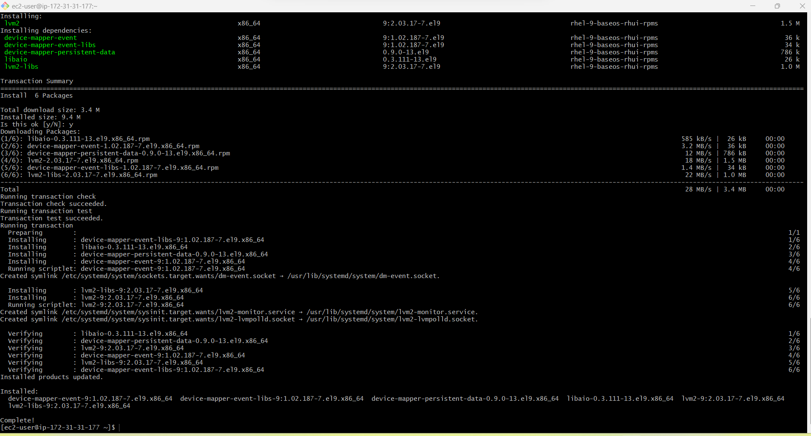

`sudo lvmdiskscan`

### Use pvcreate utility to mark each of 3 disks as physical volumes (PVs) to be used by LVM

`sudo pvcreate /dev/nvme1n1p1`
`sudo pvcreate /dev/nvme2n1p1`
`sudo pvcreate /dev/nvme3n1p1`

Verify that your Physical volume has been created successfully by running

`sudo pvs`

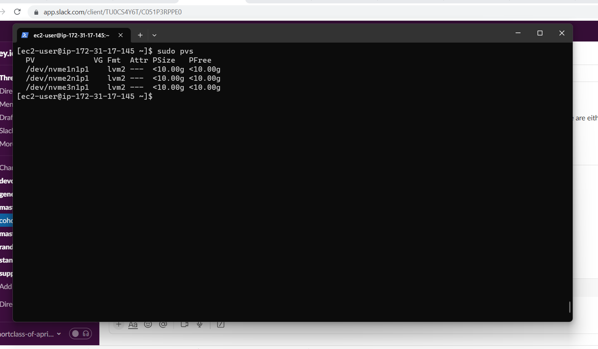

### Use vgcreate utility to add all 3 PVs to a volume group (VG). Name the VG webdata-vg
`sudo vgcreate webdata-vg /dev/nvme1n1p1 /dev/nvme2n1p1 /dev/nvme3n1p1`

Verify that your VG has been created successfully by running 

`sudo vgs`

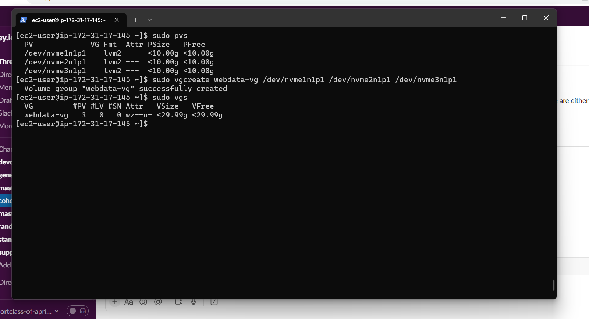

## Use lvcreate utility to create 2 logical volumes. apps-lv (Use half of the PV size), and logs-lv Use the remaining space of the PV size. NOTE: apps-lv will be used to store data for the Website while, logs-lv will be used to store data for logs.

`sudo lvcreate -n apps-lv -L 14G webdata-vg`
`sudo lvcreate -n logs-lv -L 14G webdata-vg`
Verify that your Logical Volume has been created successfully by running

`sudo lvs`

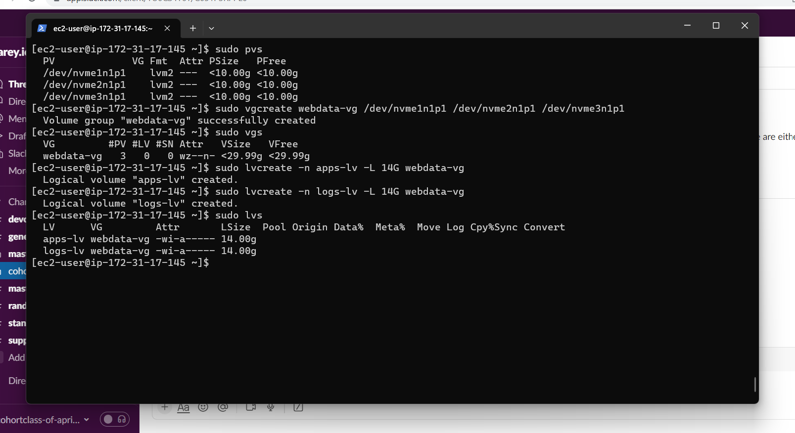

### Verify the entire setup

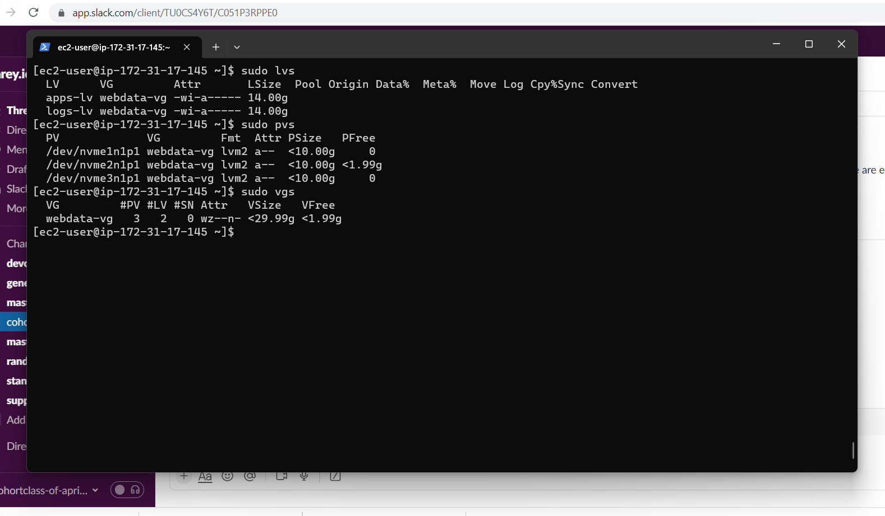

## Use mkfs.ext4 to format the logical volumes with ext4 filesystem

`sudo mkfs -t ext4 /dev/webdata-vg/apps-lv`
`sudo mkfs -t ext4 /dev/webdata-vg/logs-lv`

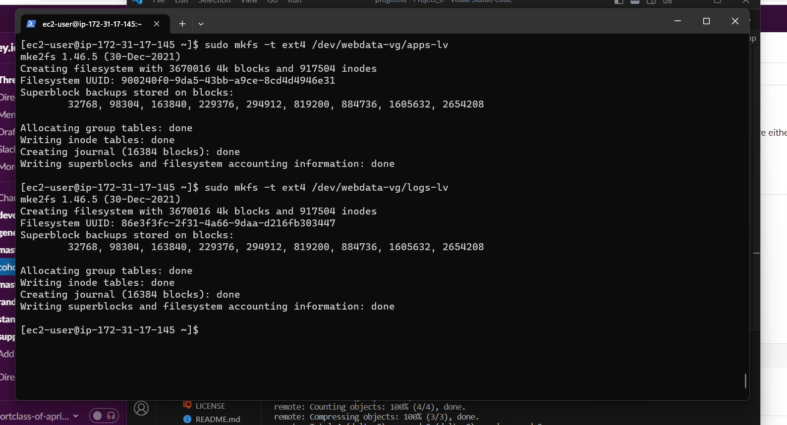

## Create /var/www/html directory to store website files

`sudo mkdir -p /var/www/html`

## Create /home/recovery/logs to store backup of log data

`sudo mkdir -p /home/recovery/logs`

## Mount /var/www/html on apps-lv logical volume

`sudo mount /dev/webdata-vg/apps-lv /var/www/html/`

## Use rsync utility to backup all the files in the log directory /var/log into /home/recovery/logs (This is required before mounting the file system)

`sudo rsync -av /var/log/. /home/recovery/logs/`

## Mount /var/log on logs-lv logical volume. (Note that all the existing data on /var/log will be deleted. That is why step 15 above is very important)

`sudo mount /dev/webdata-vg/logs-lv /var/log`

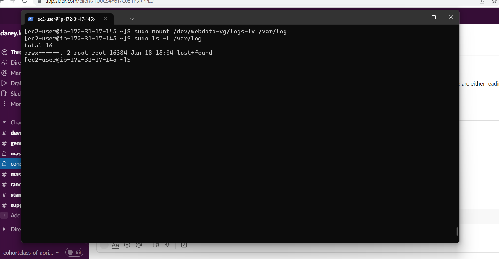

## Restore log files back into /var/log directory

`sudo rsync -av /home/recovery/logs/. /var/log`

## UPDATE THE `/ETC/FSTAB` FILE

`sudo blkid`

`sudo vi /etc/fstab`

## Update /etc/fstab in this format using your own UUID and rememeber to remove the leading and ending quotes

## Test the configuration and reload the daemon

`sudo mount -a`
`sudo systemctl daemon-reload`

### Step 2 — Prepare the Database Server

Repeat the same steps as for the web server, but instead of apps-lv create db-lv and mount it to /db directory instead of /var/www/html

### Step 3 — Install WordPress on your Web Server EC2

## Update the repository

`sudo yum -y update`

## Install wget, Apache and it’s dependencies

`sudo yum -y install wget httpd php php-mysqlnd php-fpm php-json`

Start Apache

`sudo systemctl enable httpd`
`sudo systemctl start httpd`

## To install PHP and it’s depemdencies

`sudo yum install https://dl.fedoraproject.org/pub/epel/epel-release-latest-8.noarch.rpm`
`sudo yum install yum-utils http://rpms.remirepo.net/enterprise/remi-release-8.rpm`
`sudo yum module list php`
`sudo yum module reset php`
`sudo yum module enable php:remi-7.4`
`sudo yum install php php-opcache php-gd php-curl php-mysqlnd`
`sudo systemctl start php-fpm`
`sudo systemctl enable php-fpm`
`setsebool -P httpd_execmem 1`

## Restart Apache

`sudo systemctl restart httpd`

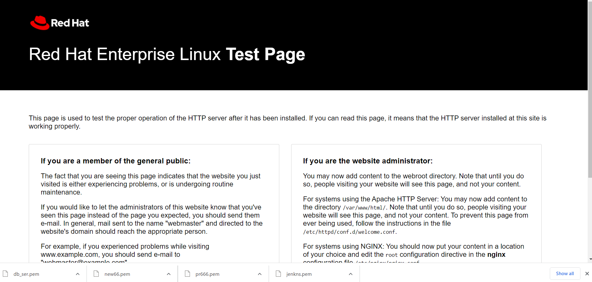

## Download wordpress and copy wordpress to var/www/html
 `mkdir wordpress`
  `cd   wordpress`

## download worpress

`sudo wget http://wordpress.org/latest.tar.gz`

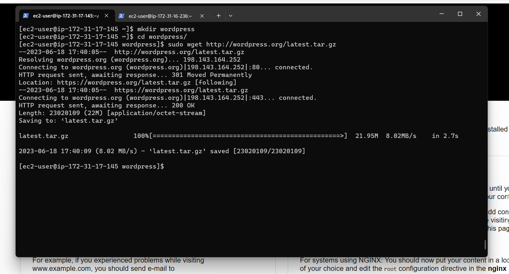

## Extract wordpress

 `sudo tar xzvf latest.tar.gz`

## Configure SELinux Policies
  `sudo chown -R apache:apache /var/www/html/wordpress`
  `sudo chcon -t httpd_sys_rw_content_t /var/www/html/wordpress -R`
  `sudo setsebool -P httpd_can_network_connect=1`

  ### Step 4 — Install MySQL on your DB Server EC2

  `sudo yum update`
   `sudo yum install mysql-server`

   ### tep 5 — Configure DB to work with WordPress

   `sudo mysql`
CREATE DATABASE wordpress;
CREATE USER `myuser`@`<Web-Server-Private-IP-Address>` IDENTIFIED BY 'mypass';
GRANT ALL ON wordpress.* TO 'myuser'@'<Web-Server-Private-IP-Address>';
FLUSH PRIVILEGES;
SHOW DATABASES;
exit

### Step 6 — Configure WordPress to connect to remote database.
Hint: Do not forget to open MySQL port 3306 on DB Server EC2. For extra security, you shall allow access to the DB server ONLY from your Web Server’s IP address, so in the Inbound Rule configuration specify source as /32

## Install MySQL client and test that you can connect from your Web Server to your DB server by using mysql-client
`sudo yum install mysql`
`sudo mysql -h 172.31.16.236 -u wordpress -p`

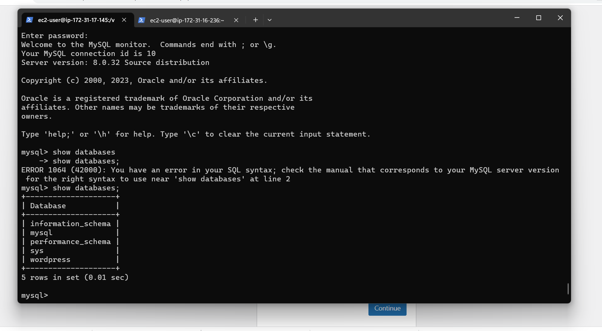

## Change permissions and configuration so Apache could use WordPress

## Enable TCP port 80 in Inbound Rules configuration for your Web Server EC2 (enable from everywhere 0.0.0.0/0 or from your workstation’s IP)

## Try to access from your browser the link to your WordPress

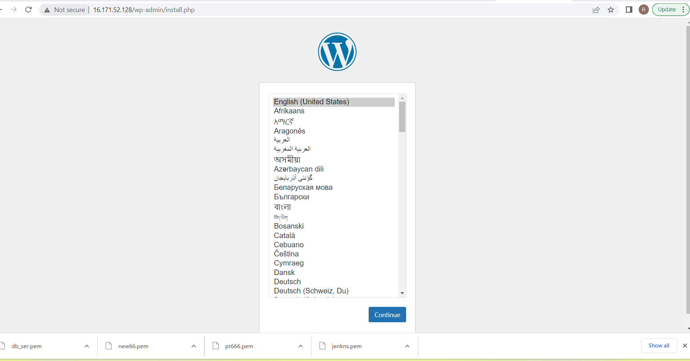

The End
 
Bye
